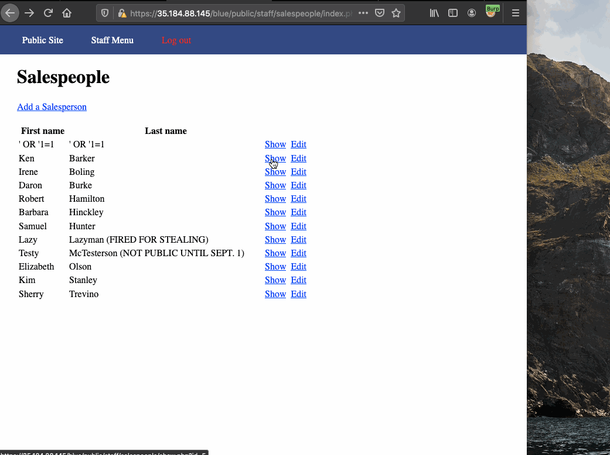
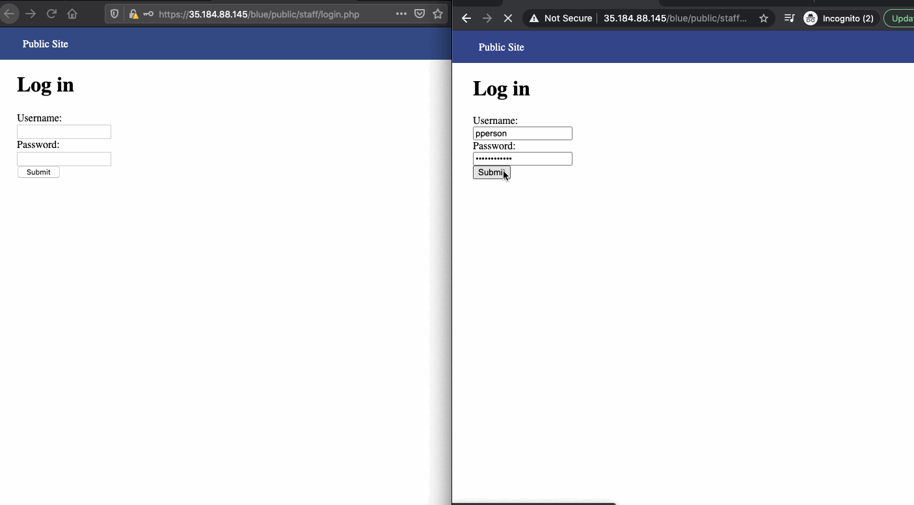
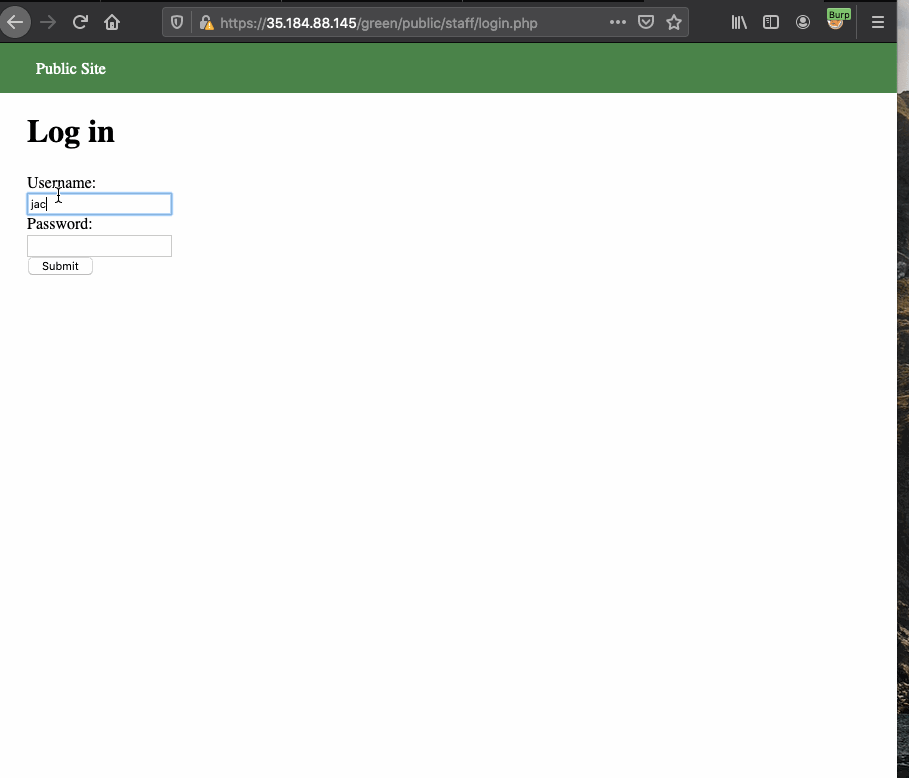
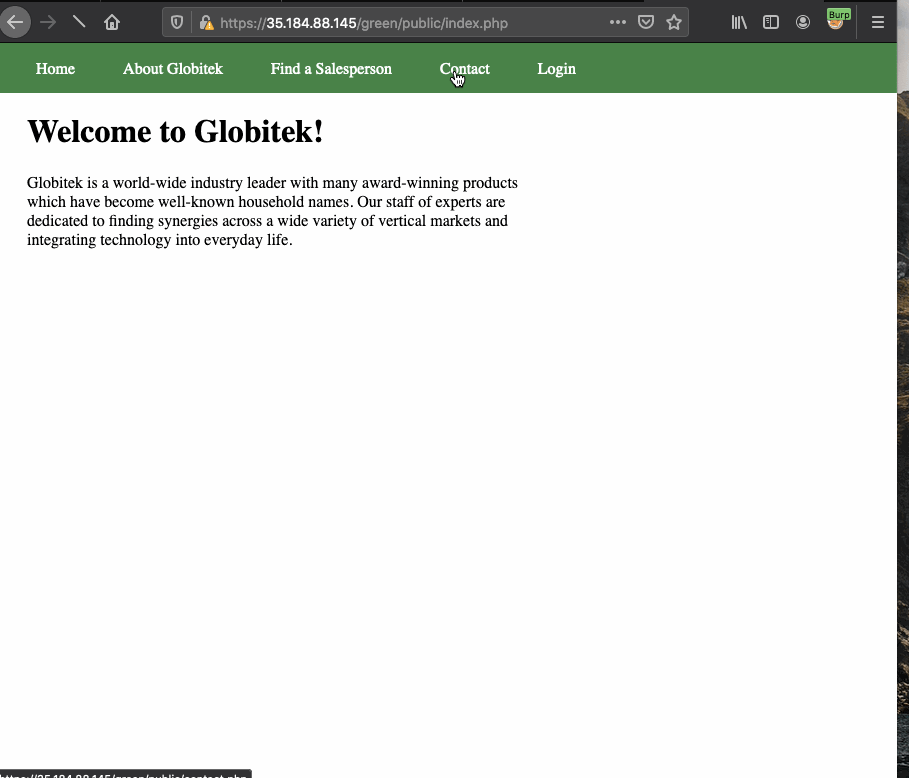
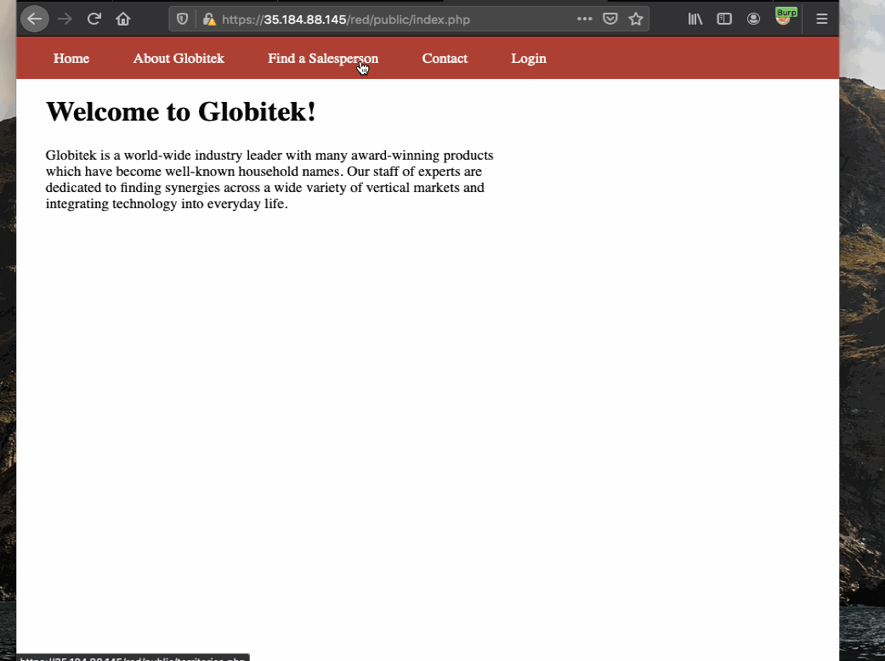
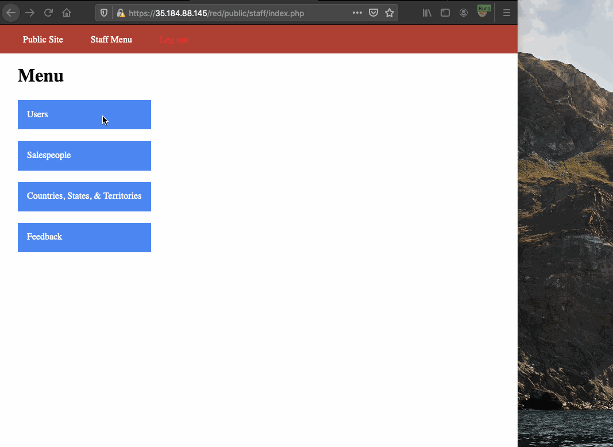

# Project 8 - Pentesting Live Targets

Time spent: 19 hours spent in total

> Objective: Identify vulnerabilities in three different versions of the Globitek website: blue, green, and red.

The six possible exploits are:

* Username Enumeration
* Insecure Direct Object Reference (IDOR)
* SQL Injection (SQLi)
* Cross-Site Scripting (XSS)
* Cross-Site Request Forgery (CSRF)
* Session Hijacking/Fixation

Each color is vulnerable to only 2 of the 6 possible exploits. First discover which color has the specific vulnerability, then write a short description of how to exploit it, and finally demonstrate it using screenshots compiled into a GIF.

## Blue

Vulnerability #1: SQL Injection

Description: In blue version of Globitek website, sqli can be performed because input is not sanitized properly. Adding '(singe quotation) on url of salesperson gives error of "Database query failed". Showing sqli can be performed. Adding 'or'1=1;-- on url instead gives record of different salesperson.  



Vulnerability #2: Session Hijacking/Fixation

Description: In blue version of Globitek website, session hijacking and fixation can be performed because it doesnot regenerate session ID which other two version does. Using a different browser, google chrome(target) to login and using the session id tool to view current session and opening same blue version of website which is not logged in another brwoser: firefox (attacker). Using session id from google chrome and changing session id of firefox browser allowed to log in through session hijacking. 



## Green

Vulnerability #1: Username Enumeration

Description: In green version of Globitek website, username enumeration is one of two vulnerabilities. While using random username and password in login page, it resulted into error which says, "Log in was unsuccessful" when such credentials doesnot exist. But, while existing username as "jmonroe99" and "pperson" with random password in login page is inserted. It gave the bold form of "Log in was unsuccessful". Giving way to figure out valid username.



Vulnerability #2: Cross-Site Scripting

Description: In green version of Globitek website, Cross Site Scripting is one of the two vulnerabilities. Contact page of green version of website can be used to insert malicious code on feedback input which when viewed by user or admin will result into message pop-up in this case.
Malicious code in this case:
```
<script>alert("Saiman found the XSS")</script>())))
```




## Red

Vulnerability #1: Insecure Direct Object Reference

Description: In red version of Globitek website, Insecure Direct Object Reference is one of two vulnerabilities. When logged in and seeing the database of salesperson shows that "Testy McTesterson" name whose id = 10 will not be public until September 1. While going through public site and seeing some listed salesperson info, just changing the id = '10' in url will result into the 'Testy McTesterson' page which is not supposed to be seen.



Vulnerability #2: Cross-Site Request Forgery

Description: In red version of Globitek website, Insecure Direct Object Reference is one of two vulnerabilities. Using repeater in burp, one can change the contents of user database without valid csrf token.




## Notes

Describe any challenges encountered while doing the work
